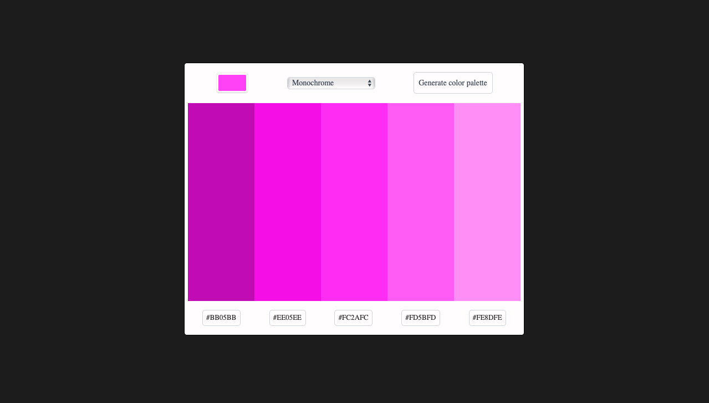

# Color Scheme Generator

## Description
+ "Color Scheme Generator" is a simple website that displays different color schemes. You pick a color of your choice from the color input and select a scheme of your choice and get a corresponding color scheme delivered to you. The color scheme is fetched using the color API. This is part of the Scrimba Front-End Career Path projects
  + This project is a part of the Scrimba Front-End Career Path projects.

## Users are allowed to:

- select the color from the color pallette
- select generating mode, out of monochrome, analogic, complement and many more
- click on one of the five colors generated to copy its hex value to the clipboard

## Built With

+ HTML
+ CSS
+ JavaScript

## Live Demo

- Live Site URL: [Here]()
